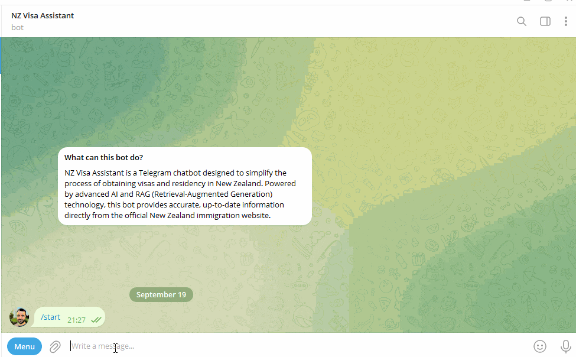

# New Zealand Visa Information Chatbot


## Project Overview
This project aims to create a Telegram chatbot that serves as a RAG (Retrieval-Augmented Generation) assistant for answering user questions about obtaining visas and residency in New Zealand. The chatbot is designed to improve upon traditional search methods by providing more accurate and context-aware responses based on information from the official New Zealand immigration website: https://www.immigration.govt.nz/new-zealand-visas

### Key Features:
- Utilizes Large Language Models (LLMs) to provide interactive and informative responses
- Implements RAG technology for enhanced information retrieval and answer generation
- Provides links to official sources, ensuring users can verify information and access additional details

### Target Audience:
The primary audience for this chatbot includes individuals seeking to understand New Zealand's immigration laws, particularly those interested in obtaining visas or residency. This could include potential immigrants, students, workers, or anyone planning an extended stay in New Zealand.

### Scope of Capabilities:
The chatbot is designed to answer a wide range of questions related to New Zealand immigration, including but not limited to:
- Visa types and requirements
- Application processes
- Eligibility criteria for different visas and residency options
- Documentation needed for applications
- Processing times and fees
- Rights and responsibilities under different visa categories

### Problem Solved:
This chatbot addresses the challenge of navigating complex immigration information by providing an easy-to-use, conversational interface. It aims to simplify the process of finding accurate, up-to-date information about New Zealand's immigration policies and procedures, saving users time and reducing confusion often associated with parsing through extensive government websites.

This project is developed as a final project for the [LLM Zoomcamp course](https://github.com/DataTalksClub/llm-zoomcamp/), demonstrating the practical application of Large Language Models in creating an valuable tool for real-world information retrieval and assistance.

## Data Collection and Parsing

Data is collected by scraping the official New Zealand Immigration website. The data is then parsed and stored in a JSON file for indexing and retrieval.
The parsing [script](scripts/parser.py) extracts relevant information from the website.
Parsed data stored in the [data](data) directory, but if you want to parse the data yourself, follow the instructions below.

To run the parser script, use the following command:
```bash
pipenv install
pipenv run python scripts/parser.py
```
> [Script](scripts/parser.py) has optional arguments, use `--help` to see them.

## Experiments in Jupiter Notebooks

### Basic RAG flow

The basic flow is presented in [this notebook](notebooks/1.basic_rag.ipynb).
It uses the `minisearch` library for search and the `anthropic' api for RAG.

### Evaluating different retrieval approaches

I created ground truth data for evaluating different retrieval approaches using the [script](scripts/generate_ground_truth.py).

In the [evaluation notebook](notebooks/2.retrieval_evaluation.ipynb) I tested various retrieval methods including Minsearch and Elasticsearch configurations. I compared text-based and vector-based search, with and without content chunking. My analysis, using metrics like Hit Rate, MRR, and NDCG, revealed that Elasticsearch's combined search method performed best. This approach, leveraging both text and vector capabilities, was chosen for its robust performance across diverse query types.


### Evaluating different RAG approaches

In this [evaluation notebook](notebooks/3.RAG_evaluation.ipynb), I compared different RAG approaches using Anthropic's LLM API. I evaluated multiple prompts and search strategies to determine the most effective method for generating responses. By analyzing metrics like LLM-as-a-judge and ROUGE scores, I identified the optimal RAG configuration for this chatbot. The chosen approach combines a specific prompt with a search query to produce accurate and informative answers.

## Interface

The chatbot interface is implemented by aiogram library and is containerized using Docker-compose.



The application is located in [app](app) directory.

Before running the application, you need to set the environment variables.

```bash
cp app/.env.example app/.env
```

Then fill in the `.env` file with your Telegram bot token and Anthropic API key.

#### Getting a Telegram Bot Token

To obtain a Telegram bot token:

1. Open Telegram and search for the BotFather (@BotFather).
2. Start a chat and send the command `/newbot`.
3. Follow the prompts to create a new bot. Choose a name and username for your bot.
4. Once created, BotFather will provide you with a token. This is your bot token.
5. Copy this token and paste it into your `.env` file.

Remember to keep your token secure and never share it publicly.

### Running the Application with Docker Compose

To run the application using Docker Compose, follow these steps:

1. Ensure you have Docker and Docker Compose installed on your system.

2. Navigate to the [app](app) directory in your terminal.

3. Build and start the Docker containers:
   ```bash
   docker-compose up --build
   ```

4. The application will now be running. You can interact with the chatbot through Telegram.

5. To stop the application, use Ctrl+C in the terminal where it's running, or run:
   ```bash
   docker-compose down
   ```

For subsequent runs, you can simply use `docker-compose up` without the `--build` flag, unless you've made changes to the application code or dependencies.

## Bot Architecture and Features

### Architecture Overview

The New Zealand Visa Information Chatbot is built with a robust architecture that leverages several advanced technologies to provide accurate and context-aware responses. Here's an overview of the key components:

1. **Elasticsearch Backend**: Serves as the primary data store and search engine.
2. **Embedding Model**: Generates vector representations of text for semantic search.
3. **LangChain Framework**: Facilitates query transformation and translation.
4. **Anthropic API**: Powers the Large Language Model for response generation.
5. **Telegram Bot API**: Provides the user interface through the Telegram messaging platform.

### Key Features

1. **Hybrid Search (Text + Vector)**:
   - Combines traditional text-based search with vector similarity search.
   - Enhances retrieval accuracy by capturing both keyword matches and semantic similarity.

2. **Embeddings Generation**:
   - Utilizes a pre-trained embedding model to convert text into high-dimensional vectors.
   - Enables semantic understanding and comparison of queries and documents.

3. **Data Injection Pipeline**:
   - Automates the process of indexing new data into Elasticsearch.
   - On first run, if the Elasticsearch index doesn't exist, the application automatically creates it and populates it with initial data.
   - The pipeline includes:
     - a. Reading data from a JSON file containing parsed information about New Zealand visas.
     - b. Generating embeddings for vector search capabilities.
     - c. Indexing processed data into Elasticsearch, including both text and vector representations.

6. **Query Transformation**:
   - Uses LangChain to preprocess and optimize user queries.
   - Improves search relevance by expanding queries and handling variations in user input.

7. **Language Translation**:
   - Integrates translation capabilities to support multilingual queries.
   - Allows users to ask questions in their preferred language while searching English content.

6. **Context-Aware Response Generation**:
   - Employs a RAG (Retrieval-Augmented Generation) approach.
   - Combines retrieved information with the power of LLMs to generate informative and contextually appropriate responses.

7. **Source Citation**:
   - Provides links to official sources in responses.
   - Ensures users can verify information and access additional details from authoritative sources.

This architecture allows the chatbot to efficiently process user queries, retrieve relevant information from a large dataset, and generate accurate, context-aware responses about New Zealand visa and immigration processes.

## Monitoring

The application includes Grafana for monitoring and visualization of system metrics. Grafana is integrated into the Docker Compose setup, allowing for easy access to performance data and system health information.

- **Grafana Dashboard**: Access the Grafana dashboard at `http://localhost:3000` after starting the application.
- **Default Credentials**:
  - Username: admin
  - Password: admin_password (as set in the docker-compose file)
- **Data Source**: Grafana is pre-configured with PostgreSQL as a data source, enabling visualization of application data and metrics.

To get started with monitoring:
1. Log in to the Grafana dashboard using the provided credentials.
2. Create custom ones to visualize your application's data and performance metrics.
3. Set up alerts to be notified of any system anomalies or performance issues.
4. Use SQL queries to create custom panels and dashboards based on your PostgreSQL data.

Remember to change the default password in a production environment for security purposes.

Note: The PostgreSQL data source is automatically provisioned, allowing you to immediately start creating dashboards based on your application's database.

The queries could be found in the [queries.md](app/grafana/queries.md) file.

Screenshots of the Grafana dashboard are available in the [dashboards.md](app/grafana/dashboards.md) file.
